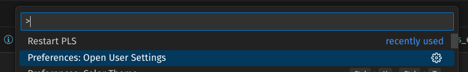
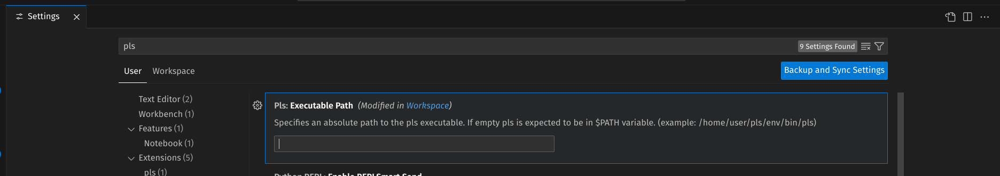
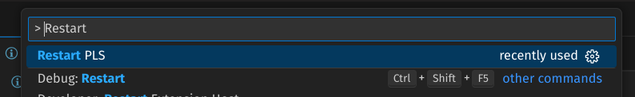

# pls

Prolog Language Server

## Installing the Language Server

- Clone, or download this repository
- Ensure you have python and pip installed

```bash
cd pls
pip install .
``` 

- pls  is now installed, and you may need to add the following line to your `bashrc` in order to make pip installables visible from your `$PATH`

```bash
echo 'PATH=#$HOME/.local/bin/:$PATH' >> ~/.bashrc
```

## Installing VS Code Extension

- Download the extension (`.vsix`) from the github release.

From the Extensions view in VS Code:
- Go to the Extensions view.
- Select Views and More Actions...
- Select Install from VSIX...

Or from the command line:

```bash 
# if you use VS Code
code --install-extension pls-vscode-extension.vsix

# if you use VS Code Insiders
code-insiders --install-extension pls-vscode-extension.vsix
``` 


### Customizing PLS startup Command

1. Open command pallet  **CTRL+Shift+P** and search for user settings



2. Provide the path to the script that calls pls




Here is an example of a startup script with a custom python environment

```bash
pls-instalation-path/.venv/bin/python3  -m  pls.main
```

### Restarting The Server 

If something isn't looking quite or there is some unexpected error or weird behaviour from the server it can be easily restarted from the command pallete search for `Restart pls` and hit enter.



If there is a persisting bug or any missing features please [open an issue](https://github.com/MartimVideira/pls/issues)


