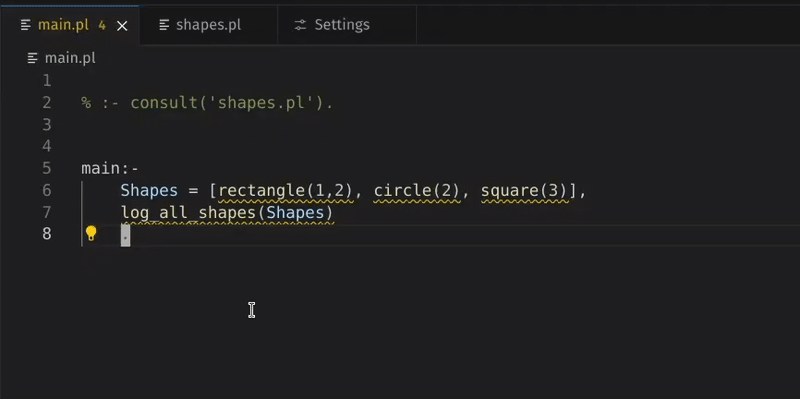
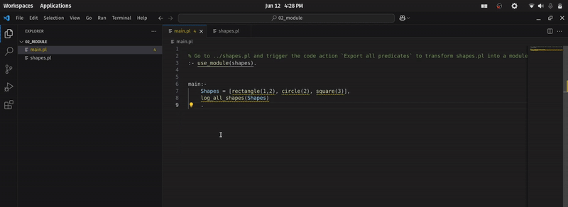
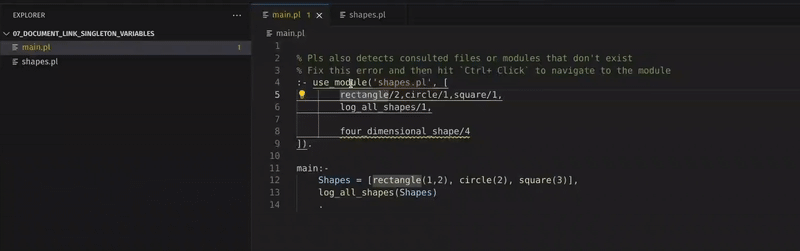
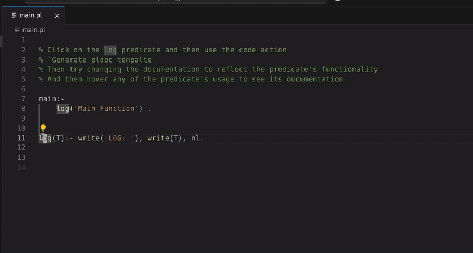
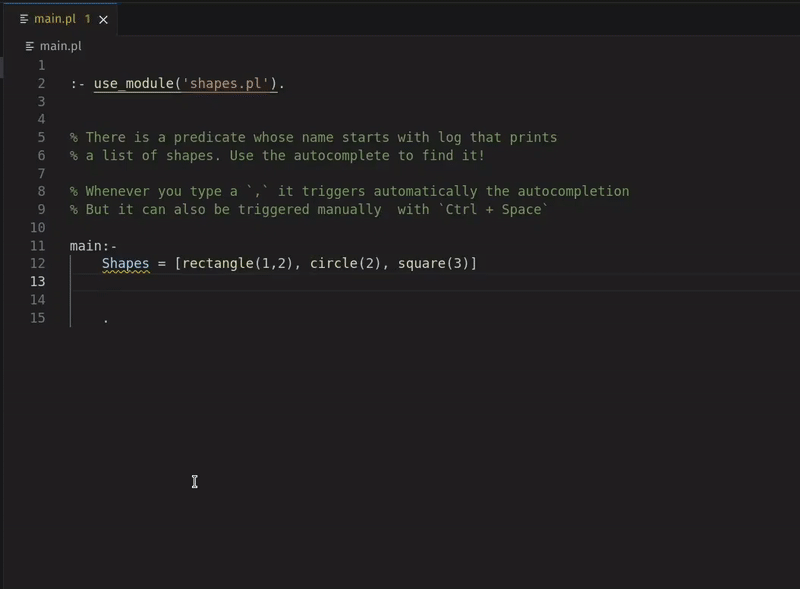
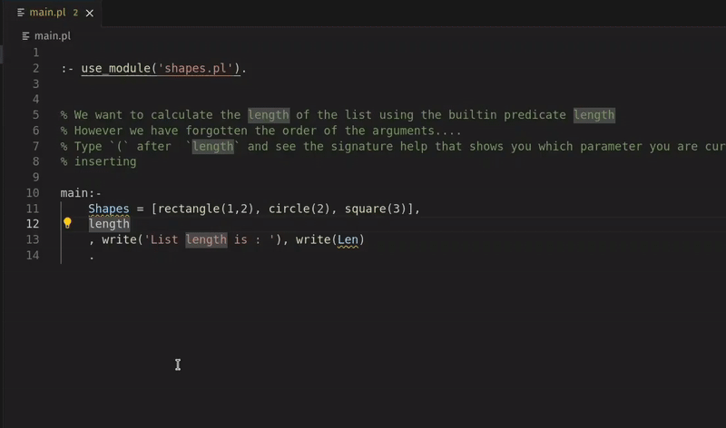
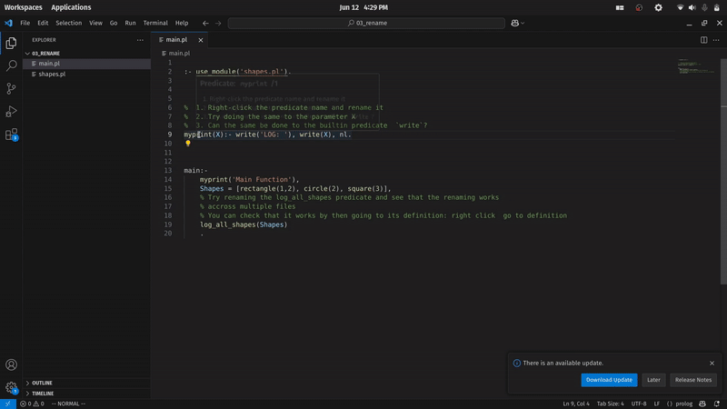
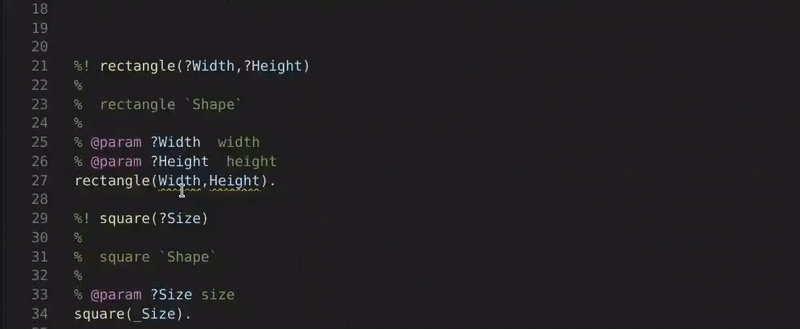
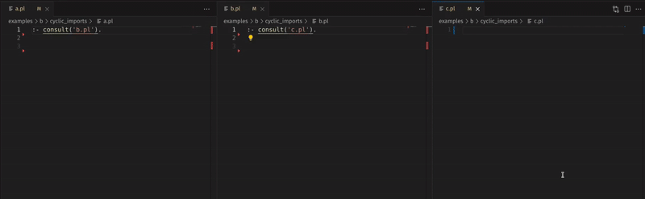
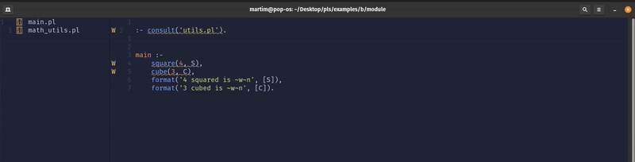

# pls

Prolog Language Server

## Installing the Language Server

- Clone, or download this repository
- Ensure you have python and pip installed

```bash
cd pls
pip install .
``` 

- pls  is now installed, and you may need to add the following line to your `bashrc` in order to make pip installables visible from your `$PATH`

```bash
echo 'PATH=#$HOME/.local/bin/:$PATH' >> ~/.bashrc
```

## Installing VS Code Extension

- Download the extension (`.vsix`) from the github release.

From the Extensions view in VS Code:
- Go to the Extensions view.
- Select Views and More Actions...
- Select Install from VSIX...

Or from the command line:

```bash 
# if you use VS Code
code --install-extension pls-vscode-extension.vsix

# if you use VS Code Insiders
code-insiders --install-extension pls-vscode-extension.vsix
``` 


### Customizing PLS startup Command

1. Open command pallet  **CTRL+Shift+P** and search for user settings


2. Provide the path to the script that calls pls


Here is an example of a startup script with a custom python environment

```bash
pls-instalation-path/.venv/bin/python3  -m  pls.main
```

### Restarting The Server 

If something isn't looking quite or there is some unexpected error or weird behaviour from the server it can be easily restarted from the command pallete search for `Restart pls` and hit enter.


If there is a persisting bug or any missing features please [open an issue](https://github.com/MartimVideira/pls/issues)


### pldoc

## Feature Overview 
### Multifile Support with consult, Hover and undefined predicate warnings

       


### Multifile Support with Modules and Export all predicates action 

  


### Module Does not Export Predicate Warning

        

### Generate Pldoc Template Action

  

### Autocomplete
  

### Signature Help




### Rename predicate, predicate arguments and renaming accross files

          

### Signleton Variables warning and action


###  Cyclic consults warnings


###  PLS working in Neovim and File Not Found for consutls and use_modules




##  💡 Language Server Features for Prolog

### 🔍 Language Navigation

- **Go to Definition** – Jump to where a predicate is defined
- **Find References** – Find all usages of a predicate
- **Hover** – View quick documentation or PlDoc comments, for predicates and operators
- **Autocomplete** – Suggest predicates,operators, atoms, variables.
- **Rename** – Refactor predicate names across the codebase
    - Predicate names
    - Predicate arguments
    - Predicate variables
- **Signature Help** – Show argument list and modes for predicates
- **Document Link** – Navigate to consulted files or consulted modules

---

### 🚨 Diagnostics

Provides real-time feedback on common Prolog issues:

- **Syntax Errors**
- **Duplicated Module Declarations**
- **Undefined Predicate** : for predicates and operators
- **Consulted Path Does Not Exist**
- **Consulted Module Does Not Exist**
- **Cyclic Consults**
- **Singleton Variable Warnings**
- **Imported Module Does Not Export Predicate**

---

### 🛠️ Code Actions

Quick fixes and refactorings directly from the editor:

- **Fix Singleton Variable**  
  Replace with `_` or prepend with `_` (e.g. `_Var`)
  
- **Export Predicates**
  - Export all currently defined predicates in the module
  - Export a specific predicate not yet listed in the module's export list

- **Generate PlDoc Template**
  - Insert a structured documentation comment for a predicate


--- 
### Other Features


- **Semantic Highlighting**
- **Highlighting of pldoc comments**