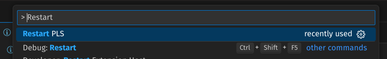

# Configuration and Troubleshooting

## Configuring Diagnostics and Rules

You can configure PLS per project using a workspace settings file at `.vscode/settings.json`.

Example:

```json
{
  "pls.passes.indentation_consistency": false,
  "pls.passes.max_line_length": 80
}
```

Use this file to enable or disable individual analysis passes and tune thresholds such as line length, clause length, indentation style, and argument limits.

## Restarting the Server

If something is not working as expected or there is unexpected behavior, restart the server from the command palette:

- Search for `Restart pls`
- Press Enter



## Known Problems

### Wrapper Predicate Analysis Limitation

Wrapper predicate analysis currently runs only for predicates that have arguments.
Predicates with arity 0 are not included in this specific analysis.

### Non-Crashing Errors While Typing

While editing code, PLS may occasionally show internal error messages but continue working normally.

Observed messages include:

- `NoneType` has no attribute `label`
- `textDocument/signatureHelp` related errors

Likely causes:

- `textDocument/signatureHelp` errors often appear while changing the arguments of a predicate during active editing.
- `NoneType`/`label` errors may also appear while writing or editing predicate arguments, but this is not consistently reproducible.

Current impact:

- PLS does not crash.
- Core functionality remains available.
- The errors can still be visible to users while writing code.

If a bug persists or a feature is missing, please [open an issue](https://github.com/MartimVideira/pls/issues).
