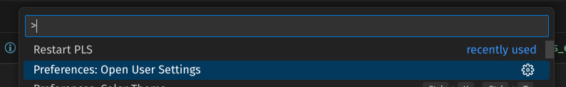
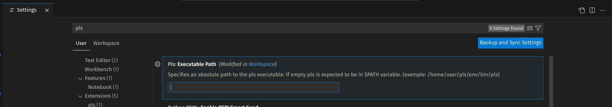

# Editor Setup

This guide covers editor integration for the Prolog Language Server (pls).

## VS Code Extension

- Download the extension (`.vsix`) from the GitHub release.

From the Extensions view in VS Code:
- Go to the Extensions view.
- Select Views and More Actions...
- Select Install from VSIX...

Or from the command line:

```bash
# if you use VS Code
code --install-extension pls-vscode-extension.vsix

# if you use VS Code Insiders
code-insiders --install-extension pls-vscode-extension.vsix
```

## Neovim Installation

```lua
local configs = require('lspconfig.configs')
local lspconfig = require('lspconfig')

vim.filetype.add({
  extension = {
    pl = "prolog",
  }
})

configs.pls = {
  default_config = {
    -- Cmd that can startup pls server: in this case make sure that pls executable in the shell
    cmd = { "pls" },
    filetypes = { "prolog" },
    root_dir = lspconfig.util.root_pattern(".git", ".mylangroot"),
    settings = {},
  }
}

-- Setup The Server
lspconfig.pls.setup({})
```

## Customizing pls Startup Command

1. Open the Command Palette (**CTRL+Shift+P**) and search for user settings.



2. Provide the path to the executable or script that starts `pls`.



The screenshot above shows a Linux-style path. The executable location depends on your OS and setup.

Common executable locations:

- Linux or macOS (global install):
  - `~/.local/bin/pls`
  - `/usr/local/bin/pls`
- Linux or macOS (virtual environment):
  - `path/to/project/.venv/bin/pls`
- Windows (global install):
  - `C:\Users\<you>\AppData\Local\Python\<python-version>\Scripts\pls.exe`
  - `C:\Python3x\Scripts\pls.exe`
- Windows (virtual environment):
  - `path\\to\\project\\.venv\\Scripts\\pls.exe`

Tip: when you run `pip install .`, the output will often indicate where scripts were installed. You can use that reported location as the path for `pls`.

Example startup script with a custom Python environment:

```bash
# Linux or macOS
pls-installation-path/.venv/bin/python3 -m pls.main

# Windows (PowerShell or cmd)
pls-installation-path\.venv\Scripts\python.exe -m pls.main
```
