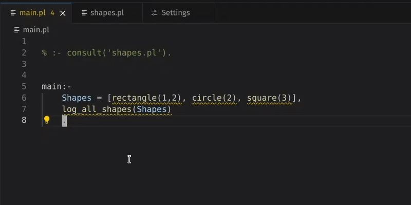
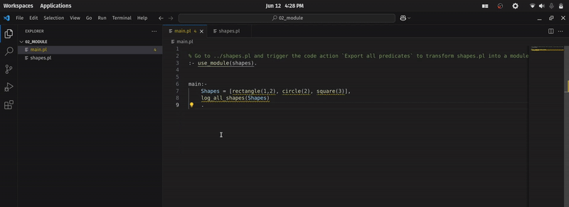
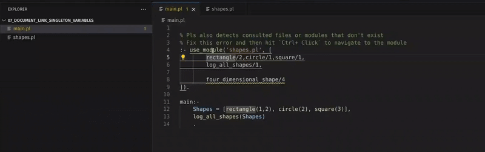
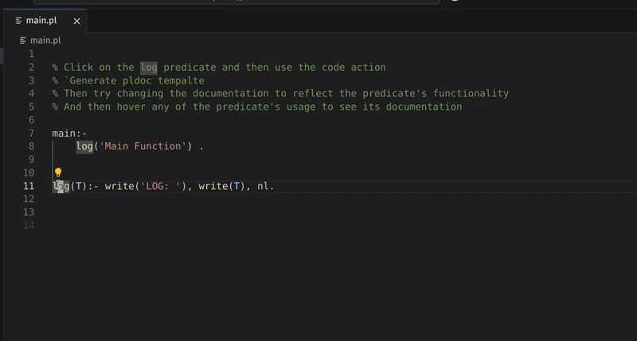
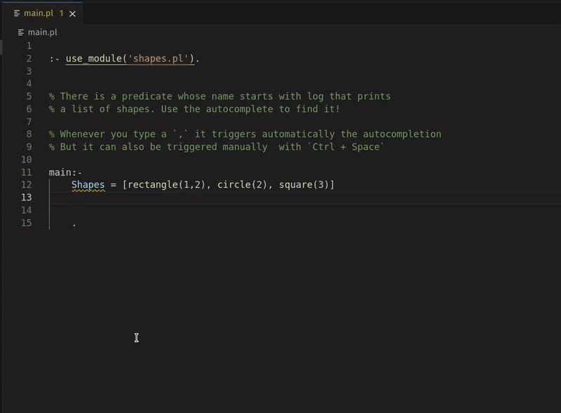
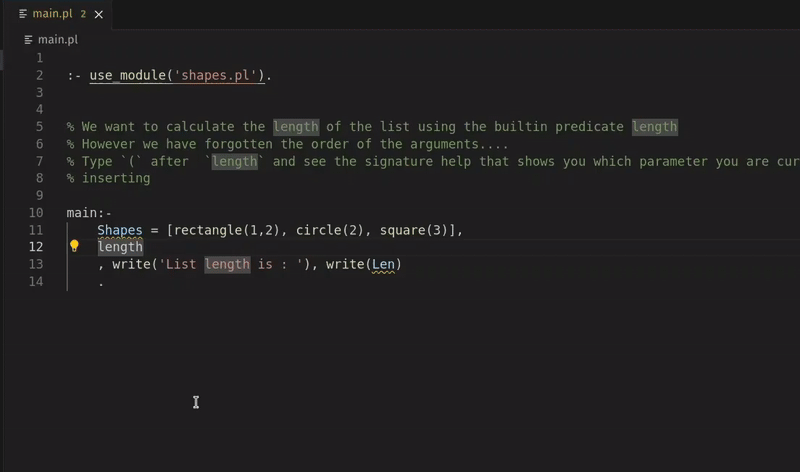
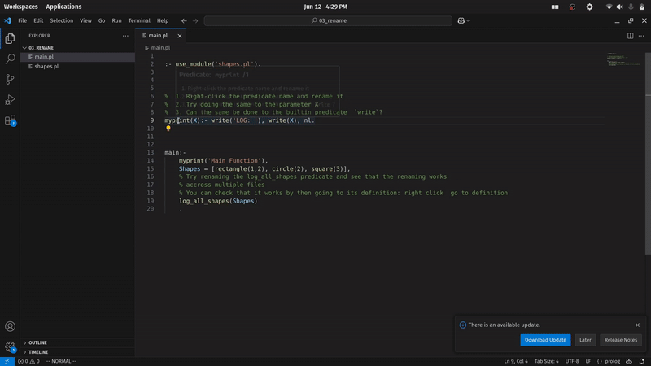
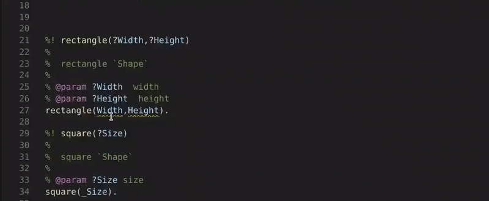
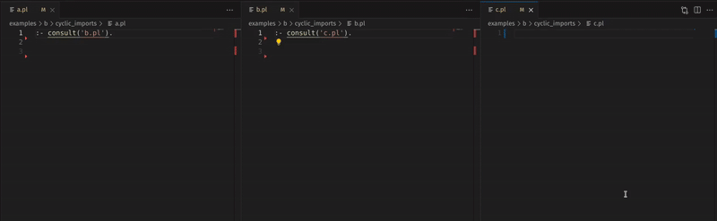
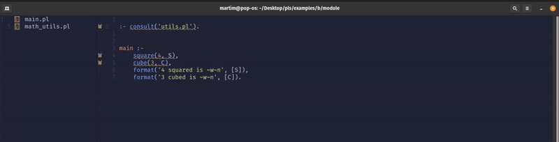

# Features

## Feature Overview

### Multifile Support with consult, Hover and Undefined Predicate Warnings

### Multifile Support with Modules and Export All Predicates Action

### Module Does Not Export Predicate Warning

### Generate PlDoc Template Action

### Autocomplete

### Signature Help

### Rename Predicate, Predicate Arguments, and Renaming Across Files

### Singleton Variables Warning and Action

### Cyclic Consults Warnings

### PLS Working in Neovim and File Not Found for Consults and use_module

## Full Feature List

### Language Navigation

- **Go to Definition**: Jump to where a predicate is defined.
- **Find References**: Find all usages of a predicate.
- **Hover**: View quick documentation or PlDoc comments for predicates and operators.
- **Autocomplete**: Suggest predicates, operators, atoms, and variables.
- **Rename**: Refactor predicate names across the codebase.
  - Predicate names
  - Predicate arguments
  - Predicate variables
- **Signature Help**: Show argument list and modes for predicates.
- **Document Link**: Navigate to consulted files or consulted modules.

### Diagnostics

Provides real-time feedback on common Prolog issues:

- **Syntax Errors**
- **Duplicated Module Declarations**
- **Undefined Predicate** for predicates and operators
- **Consulted Path Does Not Exist**
- **Consulted Module Does Not Exist**
- **Cyclic Consults**
- **Singleton Variable Warnings**
- **Imported Module Does Not Export Predicate**
- **Naming Convention Violations**
  - Predicate names should be in `snake_case`
  - Variable names should use `CamelCase` or `_CamelCase`
- **Single Element `append/3` Usage**
- **Empty List `append/3` Usage**
- **Nested List Constructs**
- **Explicit Unification Style**
- **Unnecessary Wrapper Predicates**
- **Invalid `is/2` Usage** (non-arithmetic use)
- **Line Length Limit**
- **Indentation Consistency**
- **Argument List Formatting**
- **Too Many Predicate Arguments**
- **PlDoc Argument Mismatch**
- **Clause Length Limit**
- **Multiple Subgoals on the Same Line**
- **Clause Head Length**

### Code Actions

Quick fixes and refactorings directly from the editor:

- **Fix Singleton Variable**
  Replace with `_` or prepend with `_` (for example `_Var`).
- **Export Predicates**
  - Export all currently defined predicates in the module.
  - Export a specific predicate not yet listed in the module export list.
- **Generate PlDoc Template**
  - Insert a structured documentation comment for a predicate.
- **Rename to Follow Naming Convention**
  - Rename predicate or variable references to suggested style.
- **Refactor Single Element `append/3`**
  - Rewrite to `[Element|List]` style.
- **Remove Redundant Empty List `append/3`**
- **Refactor Nested List Construct**
- **Refactor Explicit Unification**
- **Remove Wrapper Predicate and Replace Calls**
- **Convert Indentation**
  - Tabs to spaces
  - Spaces to tabs
- **Refactor Argument List Formatting**
- **Refactor Clause Head to Reduce Length**

### Other Features

- **Semantic Highlighting**
- **Highlighting of PlDoc comments**
