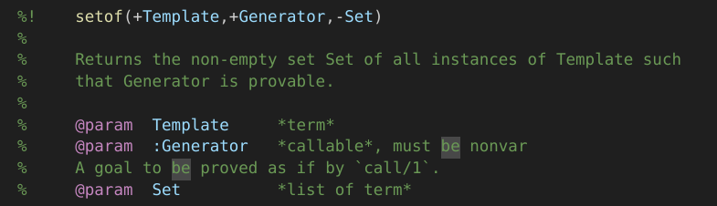
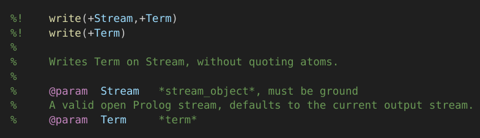
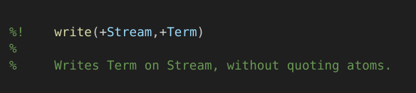
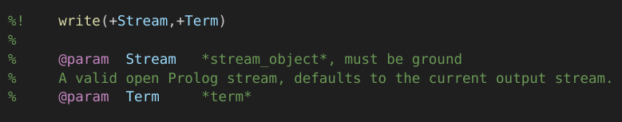

# PlDoc Support

[PlDoc](https://www.swi-prolog.org/pldoc/doc_for?object=section(%27packages/pldoc.html%27)) is the standard way to document Prolog code.
The Prolog Language Server (pls) can parse PlDoc comments to provide features like signature help, hover documentation, and more.

The more thoroughly you document your code using PlDoc, the more useful and context-aware assistance pls can offer.

Here is an example of a PlDoc comment for the builtin `setof` predicate:

pls supports these forms of PlDoc comments:

With multiple predicate templates:

With only predicate description:

With only predicate parameters:

With only predicate template:

- `%! ` starts a PlDoc comment.
- An empty comment line with `%` starts the body of the PlDoc comment.
